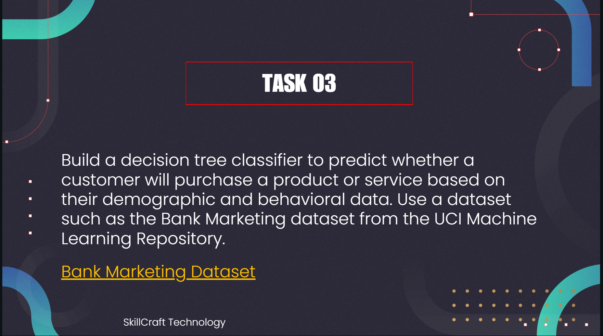

# SKILLCRAFT_DS_03
# SkillCraft Technology – Data Science Internship (Task 3)

Hi there!  
I'm ** VASUDEVAN **, and this repository contains my submission for **Task 3** of the **SkillCraft Technology Data Science Internship**. In this task, I built and evaluated decision tree classifiers to predict whether a customer will purchase a product or service, based on demographic and behavioral data from a real-world bank marketing dataset.

---

## 📋 Problem Statement

The objective is to create a predictive model that accurately identifies which clients are likely to subscribe to a bank term deposit, using features from direct marketing campaigns carried out by a Portuguese banking institution. 
---

## 🌍 About the Dataset

This project utilizes the **Bank Marketing Dataset** from the UCI Machine Learning Repository, widely used for direct marketing analytics:

- **Source:** [UCI Repository - Bank Marketing Dataset](https://archive.ics.uci.edu/ml/datasets/bank+marketing)  
- **Observations:** 45,211 client records  
- **Key Features:**
  - `age`, `job`, `marital`, `education`
  - `default`, `balance`, `housing`, `loan`
  - `contact`, `day`, `month`, `duration`, `campaign`, `pdays`, `previous`, `poutcome`
  - **Target:** `y` (subscription: yes/no)

---

## 🧰 Tools & Libraries

This project was completed in Python (Jupyter Notebook), using:

- `pandas` and `numpy` for data wrangling and analysis  
- `matplotlib` and `seaborn` for data visualization  
- `scikit-learn` for building and evaluating machine learning models  

---

## 🔍 What I Did – A Quick Walkthrough

### 1. **Data Exploration**
- Loaded the dataset and reviewed its structure.
- Summarized key statistics and checked for class balance.
- Explored relationships between input features and the target variable using visualizations.

### 2. **Data Cleaning & Preprocessing**
- Handled missing and ambiguous values.
- Encoded categorical features using label encoding and one-hot encoding as appropriate.
- Standardized feature formats to prepare for modeling.

### 3. **Feature Engineering**
- Selected the most relevant features based on domain and correlation analysis.
- Created new composite features for improved prediction (if applicable).

### 4. **Model Training & Evaluation**
- Built decision tree classifiers using both the *entropy* and *gini* criteria.
- Experimented with models with and without depth limitation for comparison.
- Evaluated model performance using accuracy, balanced accuracy, precision, and recall, with a focus on the minority (subscribed) class due to data imbalance.

### 5. **Visualization**
- Produced bar plots, count plots, and heatmaps to showcase trends and class distributions.
- Visualized decision tree structures for intuitive understanding.

---

## 💡 Key Takeaways

- **Class imbalance**: The dataset is highly skewed toward non-subscription, affecting model performance for the minority class.
- **Key predictors**: Features like `previous outcome`, `duration`, and `contact type` strongly influence subscription likelihood.
- **Model depth**: Shallow trees (lower max depth) offer better interpretability, but deeper trees slightly improve raw accuracy at the expense of overfitting.
- **Improvement opportunity**: Applying balancing techniques such as class weighting or SMOTE could enhance performance for the minority class in future work.

---

## 📊 Model Performance Summary

| Model                               | Accuracy | Balanced Accuracy | Precision (Subscribed) | Recall (Subscribed) |
|--------------------------------------|----------|-------------------|-----------------------|---------------------|
| Entropy, no max depth                | 0.89     | 0.60              | 0.67                  | 0.53                |
| Gini, no max depth                   | 0.90     | 0.62              | 0.71                  | 0.54                |
| Entropy, max depth = 3               | 0.87     | 0.65              | 0.74                  | 0.62                |
| Gini, max depth = 3                  | 0.88     | 0.67              | 0.76                  | 0.65                |

*Note: Please refer to your project output for final metric values and update the table if needed.*

---

## 🎯 Conclusion

This project demonstrates the **full data science workflow**: from cleaning and exploring real-world data, through feature selection and engineering, to building, evaluating, and interpreting machine learning models for a practical business problem. Handling imbalanced classes and extracting actionable insights remain essential challenges in prediction-driven marketing.

**Thank you for visiting and reviewing my work!** 😊  
For questions or feedback, feel free to open an issue or reach out.
